# Clerk Authentication Setup Guide

## Overview: User Management Flow

```mermaid
flowchart TD
    A["👨‍💼 Admin trong Clerk Dashboard"] --> B["➕ Create User"]
    B --> C["📧 Set Email + Password"]
    C --> D["📬 User nhận thông tin"]
    D --> E["🔐 User đăng nhập vào app"]
    E --> F["📹 Access camera stream"]
    
    G["🔄 User muốn reset password"] --> H["🔗 Sử dụng 'Forgot Password'"]
    H --> I["📨 Nhận email reset"]
    I --> J["🔑 Set password mới"]
    J --> E
    
    K["❌ User cần bị remove"] --> L["🗑️ Admin delete user trong dashboard"]
    L --> M["🚫 User không thể access nữa"]
    
    N["➕ Thêm user mới"] --> O["📧 Admin tạo account hoặc gửi invitation"]
    O --> P["✅ User activate account"]
    P --> E
```



## 1. Create Clerk Application

1. Go to [dashboard.clerk.dev](https://dashboard.clerk.dev)
2. Click "Create Application"
3. Choose application name: "PTT Home Camera"
4. Select authentication providers (Email + Password recommended)
5. Choose environment: "Production" for live use

## 2. Configure Authentication Settings

### Restrict Sign-ups (IMPORTANT)
- Go to **Settings → Authentication**
- Change **Sign-up mode** to **"Restricted"** or **"Admin only"**
- This prevents public sign-ups and makes it invitation/admin-only

### Optional: Configure Social Login
- Enable Google, Facebook, etc. if needed
- Or keep only Email/Password for simplicity

## 3. Add Authorized Users

### Method A: Create Users Manually
1. Go to **Users → Create User**
2. Enter email and set password
3. Add first name, last name (optional)
4. Repeat for each authorized user

### Method B: Use Invitations
1. Go to **Settings → Authentication**
2. Enable "Invitation mode"
3. Send invitations to specific emails
4. Users can accept invitations to create accounts

## 4. Get API Keys

1. Go to **API Keys** in dashboard
2. Copy the following keys:
   - `CLERK_PUBLISHABLE_KEY`
   - `CLERK_SECRET_KEY`

## 5. Configure Environment Variables

### Backend (.env)
```env
# Copy from env.example and fill in your keys
CLERK_PUBLISHABLE_KEY=pk_test_your_key_here
CLERK_SECRET_KEY=sk_test_your_secret_here
CLERK_JWT_VERIFICATION=true
DEVELOPMENT_MODE=false
```

### Frontend (.env.local)
```env
# Copy from env.example and fill in your keys
CLERK_PUBLISHABLE_KEY=pk_test_your_key_here
CLERK_SECRET_KEY=sk_test_your_secret_here
NEXT_PUBLIC_API_BASE_URL=http://localhost:8020
```

## 6. Production Deployment

### Update Production URLs
1. In Clerk Dashboard → **Settings → Domains**
2. Add your production domain: `https://homecam.thanhpt.xyz`
3. Update redirect URLs if needed

### Environment Variables
- Make sure production environment has correct Clerk keys
- Set `DEVELOPMENT_MODE=false` in production
- Use production Clerk keys (pk_live_... and sk_live_...)

## 7. Testing Authentication

1. Start backend: `cd homecam-api && uvicorn app.main:app --reload`
2. Start frontend: `cd homecam-web && npm run dev`
3. Navigate to `http://localhost:3000`
4. Try signing in with test user credentials
5. Verify unauthorized access is blocked

## 8. User Management

### Adding New Users
- Go to Clerk Dashboard → Users → Create User
- Or send invitation if invitation mode is enabled

### Removing Users
- Go to Clerk Dashboard → Users → Select user → Delete

### Resetting Passwords
- Users can reset their own passwords via sign-in screen
- Or admin can reset in dashboard → Users → Select user → Reset password

## Security Best Practices

- ✅ Always use "Restricted" sign-up mode for private applications
- ✅ Use strong passwords for all accounts
- ✅ Enable 2FA for admin accounts
- ✅ Regularly review user access
- ✅ Monitor sign-in logs in Clerk dashboard
- ✅ Use production keys for live deployment

## Support

If you encounter issues:
1. Check Clerk documentation: [docs.clerk.dev](https://docs.clerk.dev)
2. Verify environment variables are correct
3. Check browser console for error messages
4. Review Clerk dashboard logs for authentication issues 